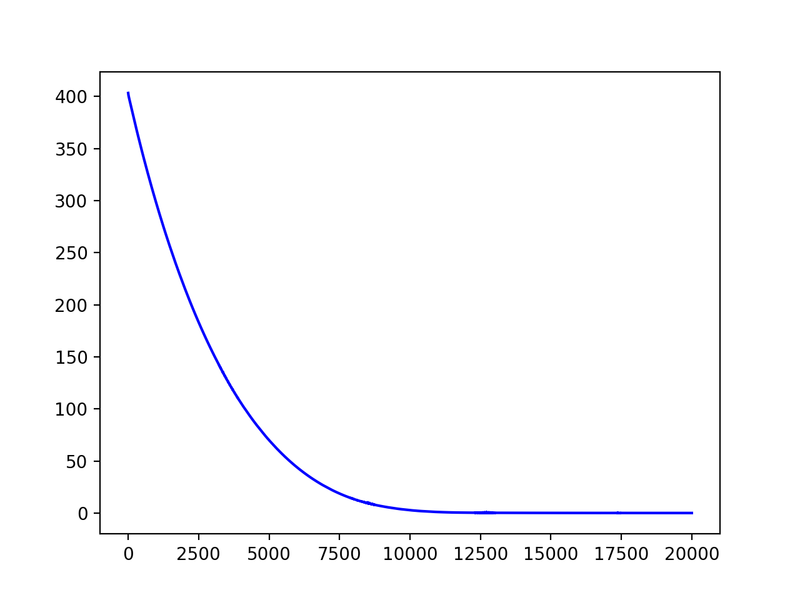
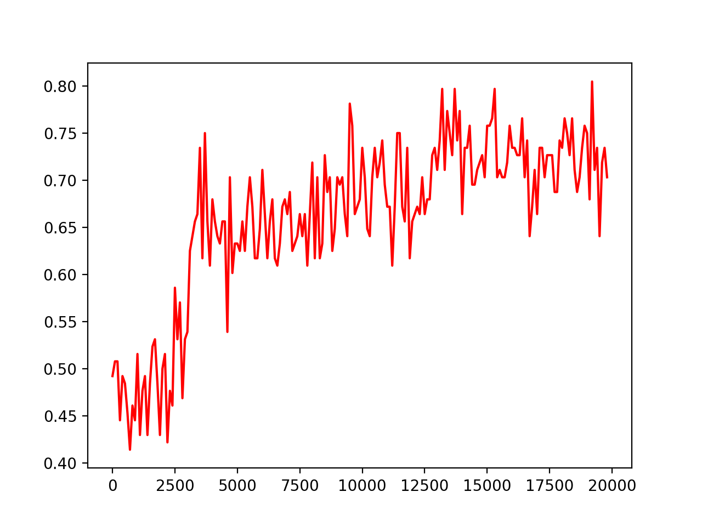

# A cnn for sentence classification
Yet another CNN network for sentence classification

Inspired by the work of Yoon Kim <a href="https://arxiv.org/pdf/1408.5882.pdf" target="_blank">Convolutional Neural Networks for Sentence Classification</a>.

## Requirements
* Python
* Tensorflow
* Numpy

## How to use

Launch the script with the following command:
```bash
python main.py --first_cat /path/to/the/first/category --second_cat /path/to/the/second/category --epochs number_of_epochs --n_batches number_of_sample_per_batch --lr learning_rate
```
Example:
```bash
python main.py --first_cat data/rt-polarity.pos --second_cat data/rt-polarity.neg --epochs 20000 --n_batches 64 --lr 0.0001
```

## Results

* Training Accuracy: 91.5%
* Validation Accuracy: 66.03%
* Testing Accuracy: 72.83%

Loss Computation:
<p align="center"></p>

Validation Accuracy:
<p align="center"></p>
